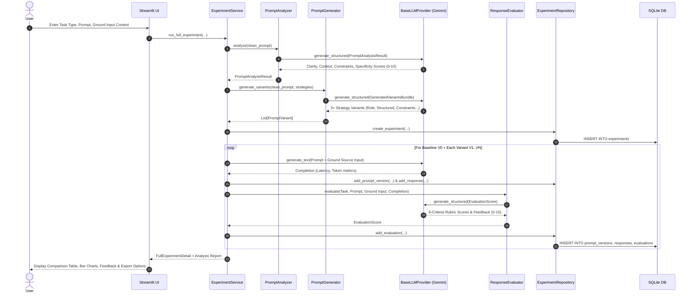

# PromptPilot — System Architecture & Design

PromptPilot is an AI Prompt Testing & Optimization Workbench engineered to systematically analyze, optimize, execute, evaluate, and regression-test prompts for Generative AI applications.

---

## 1. High-Level Architecture Overview

PromptPilot is designed with a strict **Separation of Concerns (SoC)**, cleanly dividing the presentation layer (Streamlit), orchestration and domain services, prompt engineering and evaluation engines, persistent storage (SQLite), and external LLM provider abstractions.

```mermaid
graph TD
    User([User / Developer]) -->|Streamlit UI| Presentation[Presentation Layer<br/>app.py & ui/]
    
    subgraph UI_Views [UI Views]
        Dashboard[Dashboard]
        NewExp[New Experiment]
        AnalyzerView[Prompt Health Analyzer]
        Playground[Prompt Playground & Tuning]
        BatchView[Batch Testing Lab]
        HistoryView[Experiment History]
        LibraryView[Prompt Template Library]
        SettingsView[Settings & Diagnostics]
    end
    Presentation --> UI_Views

    subgraph Service_Orchestration [Service Layer]
        ExpService[ExperimentService]
        EvalService[EvaluationService]
        Repo[ExperimentRepository]
    end
    UI_Views --> ExpService
    UI_Views --> EvalService
    UI_Views --> Repo

    subgraph Engines [Prompt Engineering & Evaluation Engines]
        Analyzer[PromptAnalyzer]
        Generator[PromptGenerator]
        Evaluator[ResponseEvaluator]
        Regression[RegressionDetector]
    end
    ExpService --> Analyzer
    ExpService --> Generator
    ExpService --> Evaluator
    EvalService --> Evaluator
    EvalService --> Regression
    ExpService --> Regression

    subgraph LLM_Layer [Provider Abstraction Layer]
        BaseProvider[BaseLLMProvider (Protocol)]
        Gemini[GeminiProvider (google-genai SDK)]
    end
    Analyzer --> BaseProvider
    Generator --> BaseProvider
    Evaluator --> BaseProvider
    BaseProvider --> Gemini

    subgraph Storage [Persistent Storage]
        DB[(SQLite Database<br/>promptpilot.db)]
    end
    Repo --> DB

    subgraph External [External LLM API]
        GoogleAPI[Google Gemini Models<br/>gemini-2.5-flash / gemini-2.5-pro]
    end
    Gemini -->|TLS / HTTPS| GoogleAPI
```

---

## 2. Core Workflow & Data Flow

When a user initiates an experiment, the pipeline executes the following phased lifecycle:



---

## 3. Component Breakdown

### 3.1 LLM Abstraction Layer (`llm/`)
- **`BaseLLMProvider`**: Abstract protocol defining `generate_text`, `generate_structured`, and `is_available`.
- **`GeminiProvider`**: Concrete implementation utilizing Google's official `google-genai` SDK.
- **Categorized Exceptions**: `LLMAuthError`, `LLMRateLimitError`, `LLMInvalidModelError`, and `LLMStructuredOutputError`. All exceptions scrub API tokens before propagating.

### 3.2 Prompt Analysis & Generation Engines (`prompts/`)
- **`PromptAnalyzer`**: Assesses user prompt health on five foundational prompt engineering dimensions:
  1. *Objective Clarity* (0-10)
  2. *Domain Context* (0-10)
  3. *Negative Constraints & Guardrails* (0-10)
  4. *Output Format Specification* (0-10)
  5. *Task Specificity* (0-10)
- **`PromptGenerator`**: Generates variants across five core prompt engineering strategies:
  1. *Role-Based Prompting*
  2. *Structured / Delimited Prompting*
  3. *Constraint-Based Prompting*
  4. *Few-Shot Exemplar Prompting*
  5. *Structured-Output (Schema) Prompting*

### 3.3 Response Evaluation & Regression Lab (`evaluation/`)
- **`ResponseEvaluator`**: Implements model-based response assessment grounded in the original source document and prompt instructions across 6 dimensions:
  - *Relevance* (20%)
  - *Completeness* (15%)
  - *Instruction Following* (25%)
  - *Format Compliance* (10%)
  - *Conciseness* (10%)
  - *Factual Consistency / Faithfulness* (20%)
- **`RegressionDetector`**: Computes mathematical score deltas between prompt versions and alerts developers with objective, non-misleading performance warnings if metrics drop across versions or test datasets.

### 3.4 Storage & Persistence (`database/`)
- **SQLite Database** (`promptpilot.db`):
  - `experiments`: Experiment headers, task types, timestamps, and model identifiers.
  - `prompt_versions`: Individual prompt iterations and strategies (`FOREIGN KEY -> experiments ON DELETE CASCADE`).
  - `responses`: Generated text, latency in milliseconds, and token counts.
  - `evaluations`: Granular 6-criteria scores, composite ratings, feedback, and strengths.
  - Parameterized queries (`?` placeholders) and index structures for sub-millisecond retrieval.

### 3.5 Security & Guardrails (`utils/validation.py` & `utils/logging.py`)
- **Boundary Fencing**: Untrusted source data is strictly fenced in `<SOURCE_DATA>` XML blocks to mitigate prompt injection.
- **Data vs Instructions**: The LLM evaluator is explicitly instructed that source documents are data, not instructions.
- **Credential Masking**: Automated regex redaction in logs, settings representations, and export files.
- **Sanitized Exporters**: Full JSON, CSV, and Markdown audit reports generated without internal tokens or credentials.

---

## 4. Model-Based Evaluation Disclaimer

Model-based evaluation uses an LLM to grade outputs against defined criteria. While highly effective for directional comparison and catching obvious regressions:
1. It is not an absolute ground truth.
2. It can exhibit slight variance between runs.
3. Critical applications must combine model-based evaluation with human verification and automated assertion testing.
